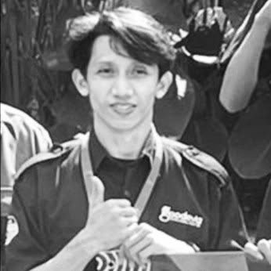

# SKILL.md — CV Asep Resume

Dokumen ini mendeskripsikan struktur, konvensi, dan cara maintain proyek ini secara menyeluruh.

---

## 1. Gambaran Umum

Proyek ini adalah **single-page CV + Blog** berbasis HTML murni dengan CSS dan JavaScript yang dipisahkan ke folder terpisah (tidak ada framework eksternal selain Google Fonts dan Font Awesome). Terdiri dari dua halaman yang bisa diswitch via navbar:

| Menu | ID Halaman | Deskripsi |
|------|------------|-----------|
| Curriculum Vitae | `#page-cv` | CV dua-kolom (sidebar + main) + right card achievement |
| Blog & Tulisan | `#page-blog` | Grid kartu blog dengan detail inline |

**Navigasi:** Navbar sticky (`position: sticky; top: 20px; z-index: 100`) dengan logo "AS" di kiri, menu di kanan.

**Fade transisi:** Setiap pindah halaman ada animasi `fadeIn` (opacity 0→1, translateY 10px→0).

---

## 2. Dependency Eksternal

```html
<!-- Font -->
<link href="https://fonts.googleapis.com/css2?family=Inter:wght@300;400;500;600&family=Lora:wght@400;500;600&display=swap" rel="stylesheet">

<!-- Ikon -->
<link rel="stylesheet" href="https://cdnjs.cloudflare.com/ajax/libs/font-awesome/6.5.0/css/all.min.css">
```

- **Inter** → font utama (body, label, tombol, nama utama di header, post-detail-title)
- **Lora** → font serif untuk sidebar name dan beberapa heading
- **Font Awesome 6.5** → semua ikon (`fas`, `fab`, `far`)

---

## 3. Sistem Warna (CSS Variables)

Semua warna dikelola melalui CSS custom properties di `:root`. **Jangan hardcode warna** di luar blok ini.

```css
:root {
  /* Skala Stone (netral warm-gray) */
  --stone-50  → #faf9f7   /* background terang */
  --stone-100 → #f3f1ed
  --stone-200 → #e8e4de   /* border, skill bar bg */
  --stone-300 → #d4cfc7   /* border aktif, divider */
  --stone-400 → #b0a99f   /* ikon muted */
  --stone-500 → #8c8479   /* teks muted, label */
  --stone-600 → #6b6358   /* teks sekunder */
  --stone-700 → #4a4440   /* teks sidebar */
  --stone-800 → #2e2b28   /* teks utama, nama */
  --stone-900 → #1a1815   /* paling gelap */

  /* Aksen Sage (hijau abu-abu) */
  --sage      → #7a8c7e   /* skill bar fill, ikon section main */
  --sage-light→ #e8ede9
  --sage-mid  → #c2cfc4

  /* Alias semantik */
  --sidebar-bg → #f0ede8  /* background sidebar */
  --text       → var(--stone-800)
  --muted      → var(--stone-500)
  --border     → var(--stone-200)
  --white      → #ffffff
  --shadow     → 0 12px 40px rgba(30,26,22,0.10), ...
}
```

**Cara ganti tema warna:** cukup ubah nilai di `:root`, seluruh komponen akan mengikuti.

---

## 4. Struktur Layout CV

```
body (padding: 32px 272px, background #e4e0d8 + watermark SVG)
└── .navbar (sticky, logo "AS" kiri, menu kanan)
└── .page.active (#page-cv atau #page-blog)
    ├── #page-cv
    │   └── .book-wrapper (flex, gap 28px)
    │       ├── .cv-card (CSS Grid: 248px | 1fr, width: 880px, flex-shrink: 0)
    │       │   ├── .sidebar        ← kolom kiri
    │       │   └── .cv-main        ← kolom kanan
    │       └── .cv-card-right (flex: 1, achievement cards)
    └── #page-blog
```

### 4a. Sidebar (`.sidebar`)

Lebar tetap **248px** (dalam grid `.cv-card`), background `--sidebar-bg`. Berisi bagian-bagian berikut secara vertikal:

| Bagian | Struktur HTML | Cara Edit |
|--------|---------------|-----------|
| Foto profil | `.profile-photo` (gambar) | Ganti file `src/images/photo_profile.jpg` |
| Nama | `.sidebar-name` | Edit teks langsung |
| Jabatan | `.sidebar-title` | Edit teks langsung |
| Kontak | `.contact-item` (icon + teks) | Duplikasi/hapus `.contact-item` |
| Sosial media | `.social-grid > .social-item` | Grid 2 kolom, duplikasi item |
| Keahlian teknis | `.skill-item` (bar progress) | Ubah `width:XX%` di style inline |
| Kemampuan | `.ability-tag` (pill/badge) | Duplikasi/hapus `<span class="ability-tag">` |

#### Menambah skill bar baru:
```html
<div class="skill-item">
  <div class="skill-label">
    <span>Nama Skill</span>
    <span>80%</span>
  </div>
  <div class="skill-bar">
    <div class="skill-fill" style="width:80%"></div>
  </div>
</div>
```

#### Menambah ability tag baru:
```html
<span class="ability-tag">Nama Kemampuan</span>
```

### 4b. Main Content (`.cv-main`)

Padding `36px 30px`, flex column dengan `gap: 24px`. Berisi section-section:

| Section | Class section title | Isi |
|---------|---------------------|-----|
| Header nama | `.main-header` | Nama besar (Inter, uppercase, 56px) + role/subtitle |
| Profil | `.profile-text` | Paragraf deskripsi diri |
| Pengalaman kerja | `.exp-item` | Role, perusahaan, bullet poin |
| Pendidikan | `.edu-item` | Tahun (badge), Sekolah (uppercase, Inter, kiri-kanan), gelar, IPK |
| Sertifikat | `.cert-grid > .cert-item` | Grid 2 kolom, ikon + nama + issuer |
| Proyek | `.project-grid > .project-item` | Grid 2 kolom, nama + deskripsi + tags |

#### Template `exp-item` (pengalaman kerja):
```html
<div class="exp-item">
  <div class="exp-header">
    <div class="exp-role">Nama Jabatan</div>
    <div class="exp-period">Bln YYYY – Bln YYYY</div>
  </div>
  <div class="exp-company"><i class="fas fa-building"></i>Nama Perusahaan · Kota</div>
  <ul class="exp-bullets">
    <li>Pencapaian atau tugas utama.</li>
  </ul>
</div>
<hr class="exp-divider">
```

> ⚠️ Hapus `<hr class="exp-divider">` pada item **terakhir** agar tidak ada garis berlebih.
> `.exp-role` otomatis diubah ke **uppercase** via CSS (`text-transform: uppercase`).

#### Template `edu-item` (pendidikan):

Tahun pendidikan menggunakan style **badge** (sama seperti `.exp-period`). Nama institusi dan kota dipisah dalam `<span>` agar berada di kiri dan kanan:

```html
<div class="edu-item">
  <div class="edu-year">YYYY – YYYY</div>
  <div>
    <div class="edu-school"><span>NAMA INSTITUSI</span><span>KOTA</span></div>
    <div class="edu-degree">Program Studi / Jurusan</div>
    <div class="edu-gpa">IPK: X.XX / 4.00</div>
  </div>
</div>
```

> `.edu-year` otomatis tampil sebagai badge (background, border, padding, radius).
> `.edu-school` menggunakan Inter, uppercase, dan `display: flex; justify-content: space-between` untuk posisi kiri-kanan.
> Inner `<div>` konten diberi `flex: 1` agar "KOTA" berada di ujung kanan.

#### Template `cert-item` (sertifikat):
```html
<div class="cert-item">
  <div class="cert-icon"><i class="fab fa-nama-ikon"></i></div>
  <div>
    <div class="cert-name">Nama Sertifikat</div>
    <div class="cert-issuer">Lembaga Penerbit</div>
    <div class="cert-year">YYYY</div>
  </div>
</div>
```

#### Template `project-item` (proyek):
```html
<div class="project-item">
  <div class="project-name">Nama Proyek</div>
  <div class="project-desc">Deskripsi singkat proyek.</div>
  <div class="project-tags">
    <span class="project-tag">Teknologi 1</span>
    <span class="project-tag">Teknologi 2</span>
  </div>
</div>
```

#### Judul section (main):
```html
<div class="main-section-title">
  <i class="fas fa-nama-ikon"></i> Nama Section
</div>
```
> `::after` pseudo-element otomatis menambah garis pembatas horizontal.

### 4c. Right Card (`.cv-card-right`)

Card di sebelah kanan `.cv-card` (dalam `.book-wrapper` flex). Mengisi sisa lebar (`flex: 1`). Berisi:

- **Penghargaan & Sertifikasi** — `.achieve-item` (icon + title + meta + desc)
- **Bahasa** — `.skill-item` (sama style dengan sidebar)
- **Minat** — `.interest-tags > .interest-tag` (pill shape)

---

## 5. Struktur Blog

### 5a. HTML Statis

```
#page-blog
└── .blog-page
    ├── .blog-header          ← judul + subtitle
    ├── .blog-layout (flex)
    │   ├── .blog-grid        ← diisi otomatis oleh JavaScript
    │   └── .post-detail-wrap
    │       ├── .post-detail  ← panel detail artikel
    │       │   ├── .post-detail-header
    │       │   │   ├── .post-detail-close  ← tombol X (absolute top-right)
    │       │   │   ├── .post-detail-category
    │       │   │   ├── .post-detail-title  ← font Inter, 22px
    │       │   │   └── .post-detail-meta
    │       │   └── .post-detail-body
    │       └── (tidak ada tombol back di sini)
```

### 5b. Data Artikel (JavaScript)

Semua konten artikel disimpan dalam array `posts` di `js/script.js`. Setiap objek post:

```javascript
{
  img: 'src/images/blog-xxx.svg',    // gambar thumbnail
  category: 'Tutorial',               // label kategori
  title: 'Judul Artikel',
  excerpt: 'Ringkasan singkat...',
  date: '10 Juni 2025',
  readTime: '8 menit',
  content: `<p>Isi artikel HTML...</p>
             <h3>Sub-heading</h3>
             <div class="modal-code">kode di sini</div>`
}
```

**Cara menambah artikel baru:** tambahkan objek baru ke array `posts`:
```javascript
const posts = [
  // ... artikel lama ...
  {
    img: 'src/images/blog-xxx.svg',
    category: 'Tutorial',
    title: 'Judul Artikel Baru',
    excerpt: 'Ringkasan artikel...',
    date: '14 Juni 2026',
    readTime: '5 menit',
    content: `<p>Konten artikel dalam HTML.</p>`
  }
];
```

### 5c. Format Konten Artikel

Tag HTML yang didukung di dalam `content`:

| Tag | Kegunaan |
|-----|----------|
| `<p>` | Paragraf biasa |
| `<h3>` | Sub-heading |
| `<ul><li>` | Daftar bullet |
| `<strong>` | Teks tebal |
| `<code>` | Kode inline |
| `<div class="modal-code">` | Blok kode (monospace, background gelap) |

### 5d. Fungsi JavaScript

| Fungsi | Tugas |
|--------|-------|
| `renderBlog()` | Render semua kartu blog ke `#blog-grid` |
| `openPost(i)` | Tampilkan detail artikel ke-`i`, toggle `.open` di `.post-detail-wrap`, hide card lain |
| `closePost()` | Sembunyikan panel detail, scroll kembali ke grid |
| `switchPage(p, e)` | Ganti halaman aktif (CV / Blog), update class `.active` di `.nav-link` |

> `renderBlog()` dipanggil otomatis saat halaman dimuat.
> `openPost()` toggle class `.open` di `.post-detail-wrap` (bukan `.post-detail`).

### 5e. Blog Thumbnail Images

Thumbnail blog disimpan sebagai file SVG di `src/images/`:

| File | Topik |
|------|-------|
| `src/images/blog-react.svg` | Tutorial React |
| `src/images/blog-docker.svg` | DevOps Docker |
| `src/images/blog-security.svg` | Security API |
| `src/images/blog-design.svg` | Design System |
| `src/images/blog-career.svg` | Karir Developer |
| `src/images/blog-ai.svg` | AI & Tech |

Masing-masing SVG berisi gradien warna relevan dengan nama topik di tengah (font Open Sans).

---

## 6. Navigasi Navbar

```html
<nav class="navbar">
  <div class="nav-brand">AS</div>
  <div class="nav-links">
    <button class="nav-link active" onclick="switchPage('cv', event)"><i class="fas fa-id-card"></i> Curriculum Vitae</button>
    <button class="nav-link" onclick="switchPage('blog', event)"><i class="fas fa-pen-nib"></i> Blog &amp; Tulisan</button>
  </div>
</nav>
```

**Styling:**
- **`.navbar`** — `position: sticky; top: 20px; z-index: 100;` — tetap di atas saat scroll. Card putih dengan shadow, `justify-content: space-between`.
- **`.nav-brand`** — Logo "AS" (inisial), Inter bold 22px, letter-spacing 1.5px.
- **`.nav-link`** — Teks polos (tanpa border/background), color `--stone-400`. Active: `--stone-800` + `font-weight: 600`.

Untuk menambah halaman baru:
1. Buat `<div id="page-namabaru" class="page">`
2. Tambah button di `.nav-links` dengan `onclick="switchPage('namabaru', event)"`

---

## 7. Watermark Background

Body memiliki watermark "RESUMEKU 2026" sebagai background:

```css
body {
  background: #e4e0d8;
  background-image: url("data:image/svg+xml,..."); /* SVG 1920×1080 grid 5×5 */
  background-repeat: no-repeat;
  background-size: cover;
  background-attachment: fixed;
  background-position: center;
}
```

SVG berisi 25 teks "RESUMEKU 2026" dalam grid, font Open Sans, rotate -30°, opacity 0.3.

---

## 8. Efek Visual

| Efek | Implementasi |
|------|--------------|
| Fade transisi ganti halaman | `.page.active { animation: fadeIn .35s ease }` |
| Page-fold sudut kanan bawah | `.cv-card::after` dengan `clip-path: polygon` |
| Shadow kartu CV | `--shadow` di `.cv-card` |
| Garis section | `::after` pseudo-element pada `.main-section-title` dan `.sidebar-section-title` |
| Skill bar fill | `<div class="skill-fill" style="width:XX%">` — warna `--sage` |
| Badge tahun (pendidikan & kerja) | `.edu-year` dan `.exp-period` (background, border, padding, border-radius) |
| Kota di kanan (pendidikan) | `.edu-school` dengan `display: flex; justify-content: space-between` |
| Navbar sticky | `position: sticky; top: 20px; z-index: 100` |
| Tombol close X | `.post-detail-close` — absolute `top: 50%; right: 16px`, `transform: translateY(-50%)` |

---

## 9. Foto Profil

Foto profil menggunakan file `src/images/photo_profile.jpg` dengan class `.profile-photo`:

```html
<div class="profile-photo-wrap">
  
</div>
```

**Spesifikasi CSS:**
- Ukuran: `200px × 200px` (segiempat)
- Sudut: `border-radius: 12px` (rounded)
- Crop: `object-fit: cover`
- Border: `2px solid var(--stone-300)`

Untuk mengganti foto, cukup ganti file `src/images/photo_profile.jpg` dengan ukuran minimal 400×400px agar tajam.

---

## 10. Checklist Maintenance

Ketika ingin mengupdate CV, periksa urutan ini:

- [ ] **Identitas:** nama di `.sidebar-name`, `.main-header-name` (`<strong>ASEP</strong> SEPTIADI`), dan `<title>`
- [ ] **Jabatan:** `.sidebar-title` dan `.main-header-role`
- [ ] **Kontak:** 4x `.contact-item` (telepon, email, lokasi, website)
- [ ] **Sosial:** 4x `.social-item` di `.social-grid`
- [ ] **Skill bar:** `width:%` di setiap `.skill-fill`
- [ ] **Kemampuan:** `.ability-tag` di sidebar
- [ ] **Pengalaman:** `.exp-item` (terbaru di atas, hapus `<hr>` terakhir)
- [ ] **Pendidikan:** `.edu-item` (tahun badge, sekolah uppercase kiri-kanan, gelar, IPK)
- [ ] **Sertifikat:** `.cert-item` di `.cert-grid`
- [ ] **Proyek:** `.project-item` di `.project-grid`
- [ ] **Right card:** `.achieve-item`, `.interest-tag`, skill bar bahasa di `.cv-card-right`
- [ ] **Blog:** tambah/edit objek di array `posts` di `js/script.js`
- [ ] **CI/CD:** pastikan workflow deploy lulus setelah push ke `main`
- [ ] **Thumbnail blog:** buat file SVG di `src/images/blog-xxx.svg`
- [ ] **Navbar:** update `.nav-link` jika ada halaman baru

---

## 11. Struktur File Proyek

```
resume-asep/
├── index.html          ← HTML utama (struktur halaman)
├── css/
│   └── style.css       ← Semua stylesheet
├── js/
│   └── script.js       ← Semua JavaScript (data blog, fungsi interaktif)
├── src/
│   └── images/
│       ├── photo_profile.jpg   ← Foto profil
│       ├── blog-react.svg      ← Thumbnail blog React
│       ├── blog-docker.svg     ← Thumbnail blog Docker
│       ├── blog-security.svg   ← Thumbnail blog Security
│       ├── blog-design.svg     ← Thumbnail blog Design System
│       ├── blog-career.svg     ← Thumbnail blog Career
│       └── blog-ai.svg         ← Thumbnail blog AI & Tech
├── .github/
│   └── workflows/
│       └── deploy.yml  ← GitHub Actions workflow
├── SKILL.md            ← Dokumentasi teknis & maintenance
├── README.md           ← Informasi umum proyek
└── ARCHITECTURE.md     ← Dokumentasi arsitektur
```

---

## 12. CI/CD — GitHub Actions

Proyek ini menggunakan **GitHub Actions** untuk deploy otomatis ke **GitHub Pages**.

### Workflow file

File: `.github/workflows/deploy.yml`

```yaml
name: Deploy to GitHub Pages

on:
  push:
    branches: [main]
  workflow_dispatch:

permissions:
  contents: read
  pages: write
  id-token: write

concurrency:
  group: pages
  cancel-in-progress: false

jobs:
  deploy:
    environment:
      name: github-pages
      url: ${{ steps.deployment.outputs.page_url }}
    runs-on: ubuntu-latest
    steps:
      - uses: actions/checkout@v4
      - uses: actions/configure-pages@v5
      - uses: actions/upload-pages-artifact@v3
        with:
          path: '.'
      - id: deployment
        uses: actions/deploy-pages@v4
```

### Penjelasan

| Trigger | Keterangan |
|---------|------------|
| `push` ke `main` | Otomatis build & deploy |
| `workflow_dispatch` | Bisa di-trigger manual dari tab Actions GitHub |

### Alur

1. Checkout kode dari repository
2. Konfigurasi Pages environment
3. Upload seluruh direktori proyek sebagai artifact (tidak ada build step karena static site)
4. Deploy artifact ke GitHub Pages

### Prasyarat (sekali atur di repo)

1. Buka Settings → **Pages** → Source: `GitHub Actions`
2. Pastikan environment `github-pages` sudah diizinkan (workflow membuatnya otomatis)

### URL

Live site: `https://neangansarang.github.io/resumeku-pro/`

---

## 13. Catatan Tambahan

- Proyek ini bergantung pada Google Fonts dan Font Awesome (butuh koneksi internet untuk tampil sempurna).
- CSS dan JavaScript sudah dipisahkan ke folder masing-masing (`css/` dan `js/`) untuk kemudahan maintenance.
- Tidak ada JavaScript framework — semua manipulasi DOM menggunakan vanilla JS.
- Untuk **print/PDF**: tambahkan `@media print { .navbar { display: none; } #page-blog { display: none; } }` agar hanya CV yang tercetak.
- Bahasa konten: **Indonesia** (`lang="id"`).
- Watermark body menggunakan SVG data URI (tidak ada file eksternal).
- Thumbnail blog dalam format SVG (dapat diganti PNG/JPG dengan mengganti path di data post).
